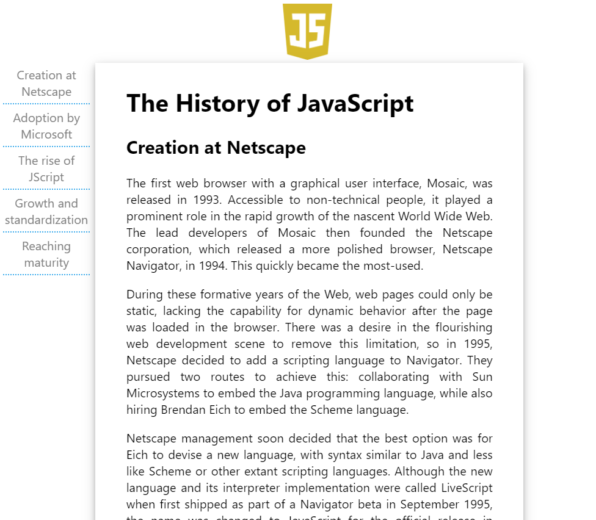
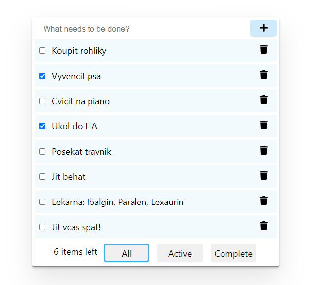
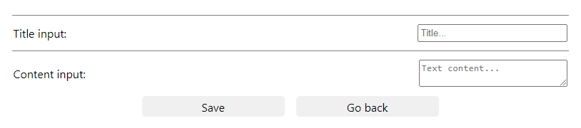

# ITA 2021 React practice

Clone this repo to get started.
## How to

```sh
git clone https://github.com/n3oAlex/ita2021-react-practice
```
### Install

```sh
npm install
```

### Start

```sh
npm run start
```

## React apps
### JS History web page

[link](https://github.com/ElaJahoda/janouskova-ita-2022/tree/main/src/JShistory)

Simple web page about History of JavaScript.



### ToDo in Redux

[link](https://github.com/ElaJahoda/janouskova-ita-2022/tree/main/src/ToDoRedux)

Simple todo app that allows adding, removing and filtering tasks. Redux is used.



### Hacker Typer

[link](https://github.com/ElaJahoda/janouskova-ita-2022/tree/main/src/HackerTyper)

Inspiration: <https://hackertyper.com/>


### Mortgage Calculator

[link](https://github.com/ElaJahoda/janouskova-ita-2022/tree/main/src/MortgageCalculator)

Mortgage Calculator calculate Remain, Principal Payment and Interest Payment, and theirs amount with inflation from inputs amounts. 


### Memory Game

[link](https://github.com/ElaJahoda/janouskova-ita-2022/tree/main/src/MemoryGame)

Memory Game with pictures of nature.


### Blog Post with Backend CRUD 

[link](https://github.com/ElaJahoda/janouskova-ita-2022/tree/main/src/BlogPost)

A simple blogging system allowing writing/editing articles in markdown and then listing/viewing/filtering/removing them. Private database is used.




### Tic-Tac-Toe

[link](https://github.com/ElaJahoda/janouskova-ita-2022/tree/main/src/TicTacToe)

Tic-Tac-Toe game is for two players. The first player to get 5 of her marks in a row (up, down, across, or diagonally) is the winner. 

